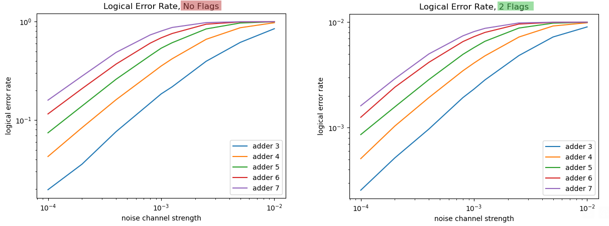

# Medusa: Lowering the Cost of Fault-Tolerance by Trading QECC for Flags

Preliminary results of increasing the fault-tolerance of quantum circuits. We consider addition circuits which are transformed with Jabalizer into the ICM form: left) the logical error rate of the circuit without taking into account any additional information; right) after adding at random positions two flags and postselecting the circuit outputs based on flags the logical error-rate decreases by orders of magnitude

**Notes**:
- Python version must be 3.8+ for multiprocessing.shared_memory to work
- `Jabalizer` https://github.com/QSI-BAQS/Jabalizer.jl
- `Stim` https://github.com/quantumlib/Stim
- icm_converter.jl may be incompatible with some versions of Jabalizer

**Files**:
- `main.py` for simple simulation with a test circuit
- `main_adders.py` for non-parallel simulation with different sized addition circuits
- `main_parallel.py` for parallelized simulation with different sized addition circuits
- `main._hadamard.py` for simulation with a logical hadamard on a surface code (WIP, no guarantee it will work)
- `main_stabilizers.py` for simple simulation with a test circuit using stabilizer measurements
- `main_find_flag_circuits.py` for parallelized simulation used to find optimal flag configurations for adder circuits
- `main_stab_par.py` for parallelized simulation of adder circuits with stabilizer measurements (assumes that main_find_flag_circuits.py has been run before)

**Running on Triton**:
- create the environment found in `env.yml`
- install needed libraries with pip (list found in `env.yml`)
- edit the filename & number of CPUs in `script.sh` if needed
- run `script.sh`

**This research was performed in part with funding from the Defense Advanced Research Projects Agency [under the Quantum Benchmarking (QB) program under award no. HR00112230006 and HR001121S0026 contracts].**
